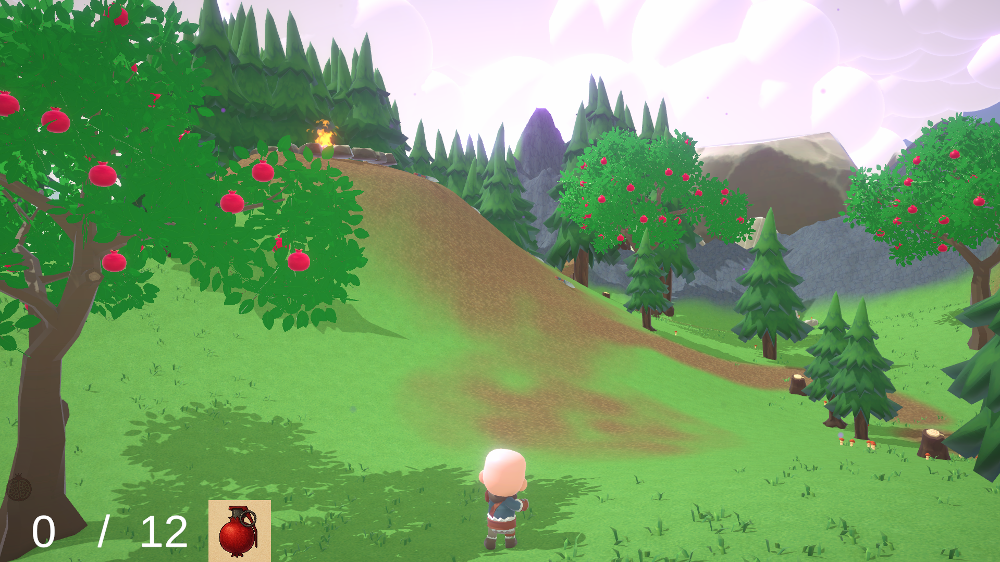
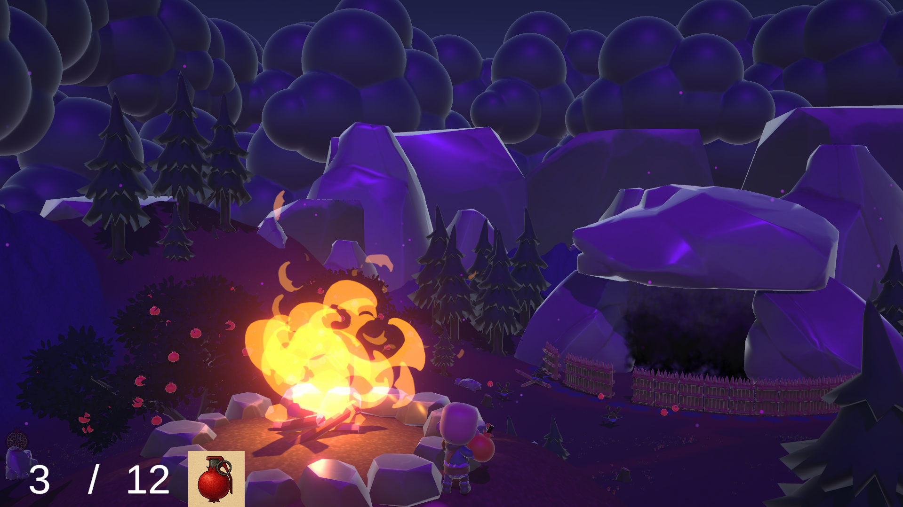
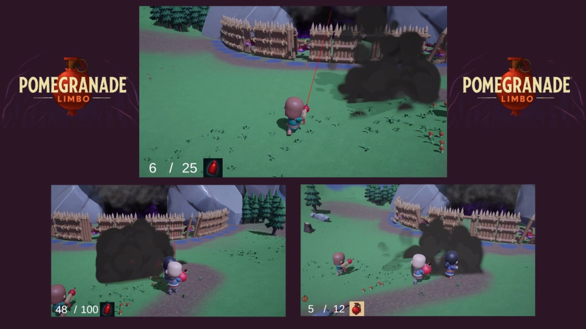
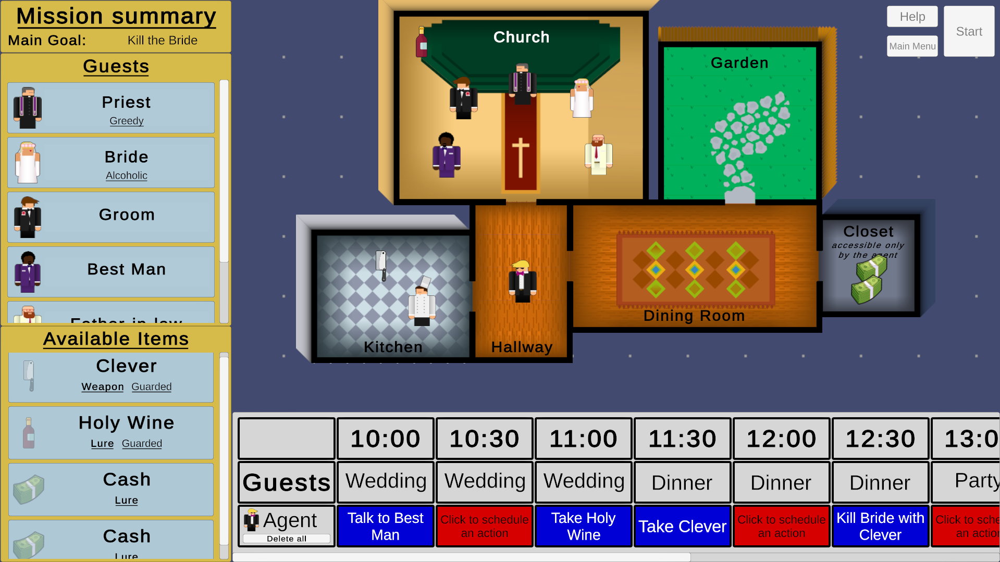

# 🎮 Project Previews

---

## 🧾 Table of Contents

**Personal Projects**  
- [A Child's Tale: Whisper of the Puppeteer](#a-childs-tale-whisper-of-the-puppeteer)  
- [Maze's Soul](#mazes-soul)  

**Academic & Collaborative Projects**  
- [Pomegranade: Limbo](#pomegranade-limbo)  
- [Murder Mystery Incorporated](#murder-mystery-incorporated)  
- [Drunk Stride - AI Project](#drunk-stride---ai-project)  
- [Tide Walker - AI Project](#tide-walker---ai-project)  

---

## A Child's Tale: Whisper of the Puppeteer

- *Description*: A first-person horror exploration game in which the player follow a guiding female voice through an abandoned house, collect items and documents, and avoid the Puppeteer—a sorcerer who turns victims into living puppets—to rescue a missing woman (and optionally free other victims).  
  Will you save her… or will he turn YOU into a puppet?

- PC platform  

**Authors:** Mauro Brochier  
**Roles:** Game Designer, Game Programmer

[Game Design Document(light version)](https://docs.google.com/document/d/1idhxIS7nfZPsK8Cw8_64o_bAl063Tsnz/edit?usp=sharing&ouid=118263974300292559359&rtpof=true&sd=true)

**Gameplay:** (Use headphones for the best experience — advanced audio techniques have been applied, and some sounds may be inaudible without them): [Watch it on Google Drive](https://drive.google.com/file/d/1CdrBNqMxAHN5BlASmGRHs-pMYHlzATpJ/view?usp=sharing)

  

  <a href="#-table-of-contents">🔙 Back to Index</a>

---

## Maze's Soul

- *Description*: The game examines how a player's mind retains a 2D representation of the game world and applies it to a 3D view of the same world. The game starts with a 30-second look at a maze, where the start and exit points are marked. When the timer runs out, the view smoothly transitions to a third-person perspective behind the player. From this point, the player must navigate the maze by recalling the path to the exit seen earlier in the 2D view. Players can use potions found around the map or purchased from hidden vendors to help them find their way out of the maze.

- Mobile platform  

**Authors:** Mauro Brochier  
**Roles:** Game Designer, Game Programmer

**Trailer:** [Watch it on Google Drive](https://drive.google.com/file/d/12W3EX7RABc43gZaFWH8LvWc5JIsfaUO5/view)  
**Gameplay:** [Watch it on Google Drive](https://drive.google.com/file/d/10Y3-aBIdrhYNOY0qGETORsAF6O3ZUk7a/view?usp=sharing)

  
  &nbsp;
  

  <a href="#-table-of-contents">🔙 Back to Index</a>

---

## Pomegranade: Limbo

- *Description*: A 2–4 online multiplayer co-op survival game set in an enchanted forest limbo. Players alternate between frantic combat—using weapons whose ammunition is crafted from harvested magical pomegranates—and strategic calm phases where they repair shelters and tend a bonfire before the petrifying dawn resets the threat.  
  Can the fire of your friendship overcome to fuel the bonfire flame?

- PC platform  

**Authors:** Mauro Brochier, Leandro Bognanni, Luca Iovine  
**Institution:** University of Milan  
**Roles:** Team Leader, Lead Designer, Game Programmer

[Game Design Document](https://docs.google.com/document/d/1fpTVNtxRZRQjRUyuJGvLJ1n6yKNfx2OF602rzuBqSH0/edit?usp=sharing)

[Game Technical Document](https://docs.google.com/document/d/1gKfPVzjNPmzunMLUdYsWIt6gt6_uNcVJ67uM8Jx2o3Q/edit?usp=sharing)

**Trailer:** [Watch it on YouTube](https://www.youtube.com/watch?v=iTNlmDLAY84)  
**Gameplay:** [Watch it on YouTube](https://www.youtube.com/watch?v=KJZ43R5dVLI)

  
  &nbsp;
  
    
  

  <a href="#-table-of-contents">🔙 Back to Index</a>

---

## Murder Mystery Incorporated

- *Description*: A 2D puzzle-strategy game for PC and browser in which you play a rookie agent of a shadowy intelligence agency. Plan and watch “perfect murders” by arranging agents’ actions and placing items on a timeline—ensuring your target dies without arousing suspicion.

- PC platform  

**Authors:** Mauro Brochier, Matteo Mangioni, Anthony Baiamonte, Christian Colombo  
**Institution:** University of Milan  
**Roles:** Game Programmer, AI Programmer

[Game Design Document](https://github.com/MauroTheB/MurderMysteryInfo/blob/main/Documents/GameDesignDocument.md)

**Trailer:** [Watch it on YouTube](https://www.youtube.com/watch?v=ZpdFg5MHrdI)  
**Gameplay:** [Watch it on YouTube](https://www.youtube.com/watch?v=wDj0Gx3CgIQ)

  

  <a href="#-table-of-contents">🔙 Back to Index</a>

---

## Drunk Stride - AI Project

- *Description*: University project - Implement behavior for an agent with circular movements on a plane, so that it moves along tangent circles and never falls off the plane it rests on.

**Authors:** Mauro Brochier  
**Institution:** University of Milan

**Video:** [Watch on Google Drive](https://drive.google.com/file/d/1fvivrFPGrrg9HMpXkVNfUsbZD5gTZ5eK/view?usp=drive_link)

  <a href="#-table-of-contents">🔙 Back to Index</a>

---

## Tide Walker - AI Project

- *Description*: University project - Implement intelligence for an agent to navigate a hilly terrain generated with Perlin noise, ensuring it avoids being submerged by a tide that rises and falls, making some areas underwater.

**Authors:** Mauro Brochier  
**Institution:** University of Milan

**Video:** [Watch on Google Drive](https://drive.google.com/file/d/1n31xoqyCNswaqyIzV96ZRgyxjISxT7HT/view?usp=drive_link)

  <a href="#-table-of-contents">🔙 Back to Index</a>

---

## 📬 Contact

- **Email:** mauro.brochier97@gmail.com  
- **Portfolio:** [Mauro Brochier](https://linktr.ee/MauroBrochier)
